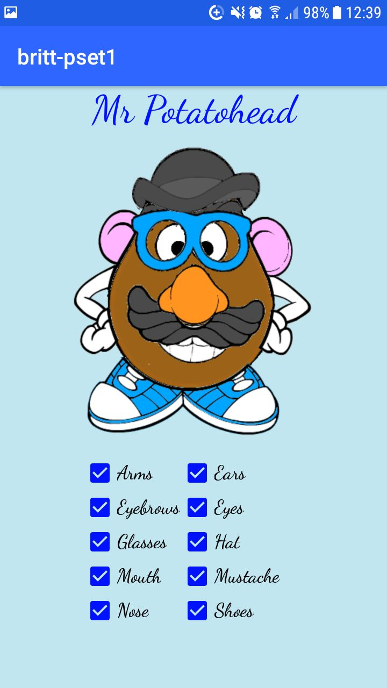
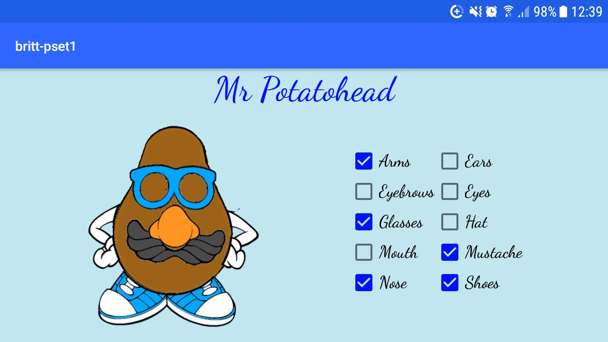

### BrittvanLeeuwen-pset1

This app gives the body of mr Potatohead. With the clickboxes, mr Potatohead can be ajusted.

The user can give mr potato head arms, ears, eyebrows, eyes, glasses, a hat, a mouth, a mustache, a nose and shoes.

The app works in normal view and landscape view, as shown below in the screenshots.
If the view is changed, all the checkboxes, and so mr Potatohead, stay the same.

